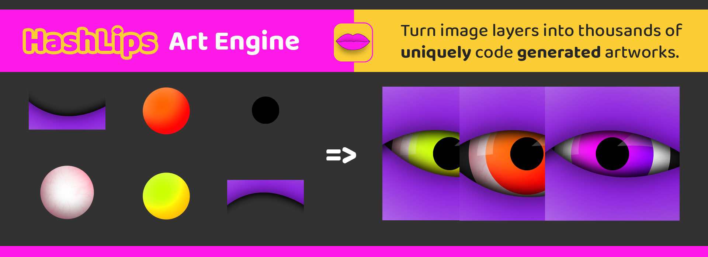

# CryptoRider NFT Collection

Welcome to the CryptoRider NFT Collection!  
This project generates unique anime character NFTs by combining elements from Naruto, Pokemon, and Demon Slayer.

## 🚀 Features

- **Algorithmic NFT Art Generation**: Create unique combinations of your favorite anime characters.
- **Rarity System**: Each NFT has different rarity traits and attributes.
- **Modern Frontend**: Beautiful gallery to preview and explore the collection.
- **MetaMask Integration**: Connect your wallet to interact with the collection.
- **Minting Ready**: Easily extend to support minting on Ethereum or compatible blockchains.

## 🖼️ Preview



## 🛠️ Getting Started

### 1. Clone the Repository

```bash
git clone https://github.com/yourusername/cryptorider-nft.git
cd cryptorider-nft
```

### 2. Install Dependencies

```bash
npm install
```

### 3. Generate NFT Art & Metadata

```bash
node src/main.js
```

This will generate images and metadata in the `build/` directory.

### 4. Run the Frontend

#### Option 1: Static Server

```bash
npx serve -s build
```
Visit [http://localhost:5000/index.html](http://localhost:5000/index.html)

#### Option 2: Node/Express Server

```bash
node server.js
```
Visit [http://localhost:5000](http://localhost:5000)

## 💻 Project Structure

```
.
├── build/              # Generated images and metadata
├── layers/             # Source images for each layer
├── src/                # Main generator scripts
├── utils/              # Utility scripts
├── frontend/           # (Optional) React frontend
├── server.js           # Express server for static files
├── index.html          # Modern NFT gallery (in build/)
└── README.md
```

## 🦊 MetaMask Integration

- Click the **Connect Wallet** button in the gallery to connect your MetaMask wallet.
- You can extend the project to support minting and blockchain interactions.

## 📦 Customization

- Edit `src/config.js` to change layer order, rarity, and NFT settings.
- Replace images in `layers/` to create your own unique collection.

## 🤝 Contributing

Pull requests are welcome! For major changes, please open an issue first to discuss what you would like to change.

## 📄 License

This project is licensed under the MIT License.

